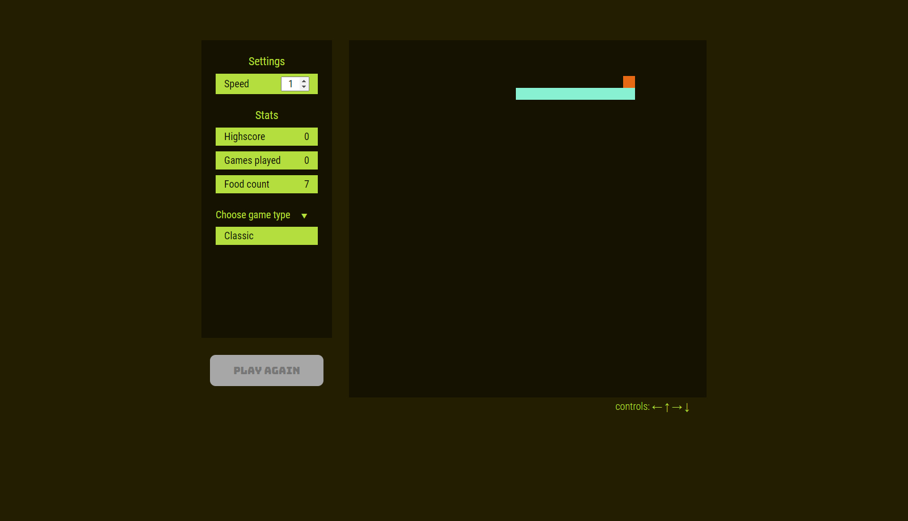

# Snake Race multiplayer online game

This is the classic game of snake with added feature online multiplayer. 

## Table of contents

- [Overview](#overview)
  - [Screenshot](#screenshot)
  - [Links](#links)
- [My process](#my-process)
  - [Built with](#built-with)
  - [Useful resources](#useful-resources)
- [Author](#author)

## Overview

There are two game modes, single player and multiplayer. 
Single player mode is all run on client side javascript.
Multiplayer mode is run on a server. With each frame, the game is updated on the server and sent back to the clients(players).

### Screenshot

### Links

- Solution URL: [Add solution URL here](https://your-solution-url.com)
- Live Site URL: [Add live site URL here](https://your-live-site-url.com)

## My process

### Built with

- HTML5
- Sass
- Flexbox
- Javascript
- Node js 
- express js 
- EJS 

### Useful resources

- [Complete Guide to CSS Flexbox](https://css-tricks.com/snippets/css/a-guide-to-flexbox/) - This helped me to remember the different features of CSS Flexbox

- [Youtube tutorial](https://css-tricks.com/snippets/css/a-guide-to-flexbox/) - This tutorial helped me with the backend section of the game. 

## Author

- Pablo Almonacid - [Portfolio](https://www.marpace.github.io/portfolio)
- Frontend Mentor - [@Marpace](https://www.frontendmentor.io/profile/Marpace)

